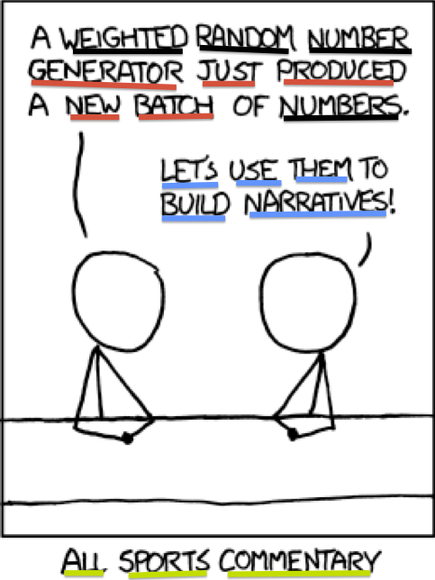

Topic Modelling of Medical Discussions
========================================================
author: Lukas Huber
date: March 2nd 2015

Motivation
========================================================


Content
========================================================

Web Scraping
========================================================


Terms
========================================================
- A *word* is the basic discrete unit from a *vocabulary* indexed {1,...,V}
- A *document* is a sequence of *N* words $\mathbf{w} = (w_{1},w_{2},...,w_{n})$
- A *corpus* is a collection of *M* documents $\mathbf{D}= (\mathbf{w_{1}},\mathbf{w_{2}},...,\mathbf{w_{m}})$

Topic Modeling
========================================================

***

Latent Dirichlet allocation
========================================================

Content
========================================================

Content
========================================================


```r
summary(cars)
```

```
     speed           dist       
 Min.   : 4.0   Min.   :  2.00  
 1st Qu.:12.0   1st Qu.: 26.00  
 Median :15.0   Median : 36.00  
 Mean   :15.4   Mean   : 42.98  
 3rd Qu.:19.0   3rd Qu.: 56.00  
 Max.   :25.0   Max.   :120.00  
```

Final Product
========================================================


```
processing file: TM Lukas Huber 2015.Rpres
Loading required namespace: servr
serving the directory nurs_lda at http://localhost:4321
Quitting from lines 46-49 (TM Lukas Huber 2015.Rpres) 
Fehler in startServer(host, port, app) : Failed to create server
```
