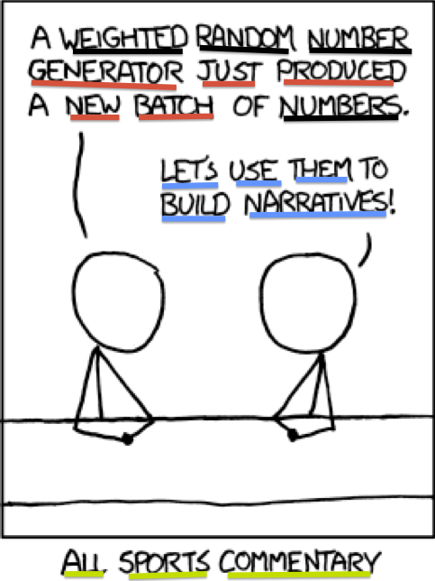

Topic Modelling of Medical Discussions
========================================================
author: Lukas Huber
date: March 2nd 2015
width: 1280

Motivation
========================================================
- natural language processing requires complex tools
- vast ammount of written text remains unanalyzed

- online boards share patients view on diseases
- Question: Can you find an structure within threads?
- Question: Is it possible to find new relations between diseases?

Content
========================================================
- Web Scraping
- Terms
- Topic Modeling
- Latent Dirichlet allocation
- Optimization of topics
- Data collection and preprocessing
- Demonstration


Web Scraping
========================================================
- Extracting information from Websites
- transformation of unstructured data (e.g. HTML)
- URL manipulation
- XPath to query XML 

```r
head(xpathSApply(PARSED, "//span[@class='citation news']/a/@href"))
```

Terms
========================================================
- A *word* is the basic discrete unit from a *vocabulary* indexed {1,...,V}
- A *document* is a sequence of *N* words $\mathbf{w} = (w_{1},w_{2},...,w_{n})$
- A *corpus* is a collection of *M* documents $\mathbf{D}= (\mathbf{w_{1}},\mathbf{w_{2}},...,\mathbf{w_{m}})$

Topic Modeling
========================================================

romance (red)
sarcasm (blue)
math (black)
language (green)
***
- statistical mixture model
- each document is a mixture of latent topics
- generative model, based on term frequencies
- bag-of-words models
- extend and build on
 - unigram models (McCallum, Thrun, Mitchell,...)
 - Latent Semantic analysis (Deerwester, Dumais, ...)
 
Latent Dirichlet allocation
========================================================
- random variable $w_i$ denotes the ith-token $i \in \{1,...,N\}$
- for vocabulary size $v \in \{1,...,V\}$
- probability of observing word $i$ in document $d_i$:
$P(w_i = v) = \sum_{j=1}^T P(w_i = v | z_i = j)P(z_i = j)$

where $z_i \in \{1,...,T\}$ for a given number of topics *T*
- probability term-topic matrix $\phi_i^{(j)} = P(w_i = v | z_i = j)$
  - *V* by *T* where $j^{th}$ column prob. dist. over words for topic *j*
- probability topic-document $\theta_j^{(d_i)} = P(z_i = j)$
  - *T* by *D* where $d^{th}$ column contains topic prob. for document *d*

Latent Dirichlet allocation cont.
========================================================

- $\alpha$ is the parameter of the Dirichlet prior on the per-document topic distributions
- $\beta$ is the parameter of the Dirichlet prior on the per-topic word distribution,

***

- $\theta_i$ is the topic distribution for document *i*
- $\phi_k$  is the word distribution for topic *k*
- $z_{ij}$ is the topic for the $j^{th}$ word in document *i*
- $w_{ij}$ is the specific word

Optimize number of topics
========================================================
Given hyperparameters $\alpha$ and $\beta$ find optimal number of topics via Bayesian model selection

$\max_T\{ p(T| \textbf{w}) \} = \max_T\{ p(\textbf{w}|T)p(T) \}$

Using a uniform prior for $p(T)$, we have $\max_T p(w|T)$. Unfortunately, computing $p(w|T)$ requires summing over all possible assignments of words to topics which is often unfeasible. Griffiths & Steyvers suggest approximating $p(w|T)$ via a harmonic mean estimator:

$p(w|T) \approx (\frac{1}{M} \sum^M_{m=1} p(\textbf{w} | \textbf{z}_m, T)^{-1})^{-1}$

where $\mathbf{z}_m$ is the $m^{th}$ sample from the posterior $p(\mathbf{z}|\mathbf{w}, T)$

Data collection and preprocessing
========================================================

Acquire the documents from one thematic

```r
url <- "board.netdoktor.de"
thematics <- netDoktorScraper(url)
```
Get all documents and clear them

```r
docs <- getAllDocumentsofThematic(df.threads)
docs.cleared <- lapply(docs, clearNE)
```
Example scraping

```r
SOURCE <-  getURL(url,encoding="UTF-8")
PARSED <- htmlParse(SOURCE)
title <- xpathSApply(PARSED, "//span[contains(@itemprop,'itemListElement')]",xmlValue)
link <- xpathSApply(PARSED, "//span[contains(@itemprop, 'itemListElement')]/a/@href")
```

Document term-matrice 
========================================================

```r
dtm.control <- list(
  tolower = T,
  removePunctuation = TRUE,
  removeNumbers = TRUE,
  stopwords = stopwords("de"),
  stemming = T,
  weighting = weightTf
)

corp <- VCorpus(VectorSource(docs.cleared))
dtm <- DocumentTermMatrix(corp, control = dtm.control)
dim(dtm)
dtm <- removeSparseTerms(dtm, 0.99)
dim(dtm)
```

Model-generation
========================================================

```r
# Initiate cluster
cl <- makeCluster(no_cores)
clusterExport(cl, "dtm.new") # Document term matrix
clusterExport(cl, "burnin") # burnin default 1000
clusterExport(cl, "iter") # iter default 1000
clusterExport(cl, "keep") # keep default 50
clusterExport(cl, "LDAt")
models <- parLapply(cl, ks, function(k) LDAt(dtm.new, k, method = "Gibbs", control = list(burnin = burnin, iter = iter, keep = keep)))

stopCluster(cl)
```

Model-fitting
========================================================

```r
harmonicMean <- function(logLikelihoods, precision = 2000L) {
  llMed <- median(logLikelihoods)
  as.double(llMed - log(mean(exp(-mpfr(logLikelihoods,
                                       prec = precision) + llMed))))
}
logLiks <- lapply(models, function(L)  L@logLiks[-c(1:(burnin/keep))])
hm <- sapply(logLiks, function(h) harmonicMean(h))

plot(ks, hm, type = "l")
```
Model-fitting
===

Creating the visualisation
===

- phi: 
matrix, with each row containing the distribution over terms for a topic, with as many rows as there are topics in the model, and as many columns as there are terms in the vocabulary. |
- theta: matrix, with each row containing the probability distribution over topics for a document, with as many rows as there are documents in the corpus, and as many columns as there are topics in the model.
- doc.length: integer vector containing the number of tokens in each document of the corpus.
- vocab: character vector of the terms in the vocabulary (in the same order as the columns of phi). Each term must have at least one character.
- term.frequency: integer vector containing the frequency of each term in the vocabulary.
- lambda.step: a value between 0 and 1. Determines the interstep distance in the grid of lambda values over which to iterate when computing relevance. Default is 0.01. Recommended to be between 0.01 and 0.1.
- mds.method: a function that takes phi as an input and outputs a K by 2 data.frame (or matrix). The output approximates the distance between topics. See jsPCA for details on the default method.

Final Product
========================================================
<iframe width='100%' height='800' src='http://localhost:4321' frameborder='0'></iframe>


Discussion
=========================================================
- extend the list of stop words
- better stemming algorithm
- create a document per entry not per thread and hold the relations.
- Correlated topic model
- Pachinko allocation (Blei et. al.) to cover longer terms (e.g. right eye)
- use the relations between threads and connect them on the person
- use time information to analyze trends or weather conditions
- OpenCL acceleration
- ... 
References and further reading
========================================================

- Rolf Fredheim, Web Scraping <http://quantifyingmemory.blogspot.co.uk/2014/02/web-scraping-basics.html>
- C.P. Sievert, XCKD Topic Modeling <https://cpsievert.github.io/projects/615/xkcd/>
- See my Seminarwork for full Bibliography
